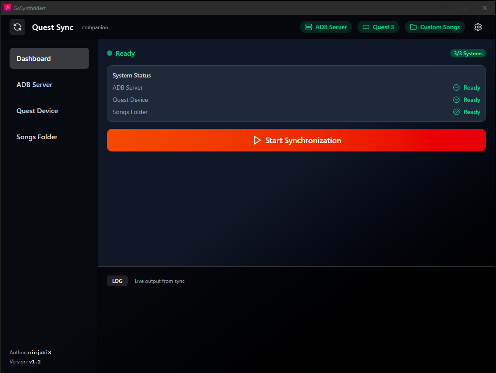

# GoSynthriderz

**GoSynthriderz** is a windows desktop application for managing and syncing custom songs with your **Meta Quest 3** headset from [synthriderz.com](https://synthriderz.com/).

Built with [Wails](https://wails.io/) (Go + React), it provides a clean, modern interface with real-time device info, status monitoring, and seamless ADB integration.

---

## ✨ Features

- **Automatic ADB Setup**  
  - Detects if Android Debug Bridge is installed.  
  - Windows: Download and install automatically to a common location.  

- **Quest 3 Device Detection**  
  - Shows connection status with a visual badge.  
  - Displays detailed device info:  
    - Model, serial number, manufacturer, build date  
    - Battery level with color-coded indicator  
    - Storage usage with progress bar

- **Custom Songs Folder Check**  
  - Detects your songs directory on the headset.  
  - Displays space usage and file count.

- **One-Click Sync**  
  - Start syncing maps/files with one button.  
  - Real-time log output.

- **Modern Dashboard UI**  
  - Tailwind CSS styling  
  - Lucide React icons  
  - Dark theme  
  - Status badges for quick at-a-glance info

---

## 📦 Installation

### Windows
1. Download the latest release from the [Releases page](https://github.com/ninjaki8/GoSynthriderz/releases).
2. Run the executable.  
3. If ADB is missing, click **Download Latest** in the app.
